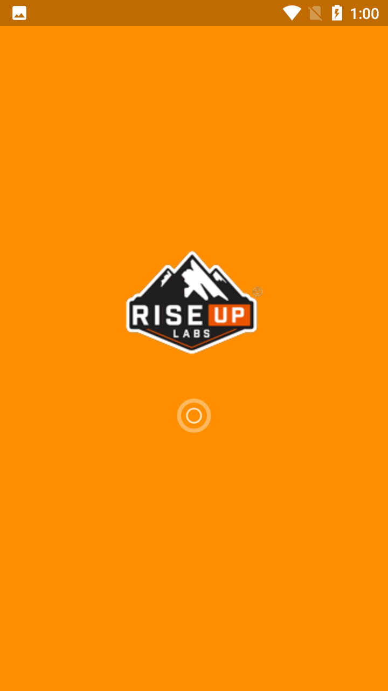
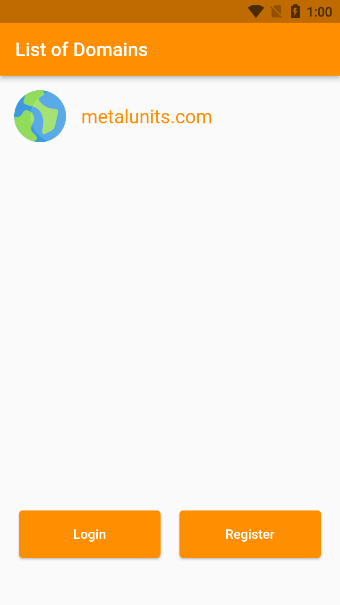
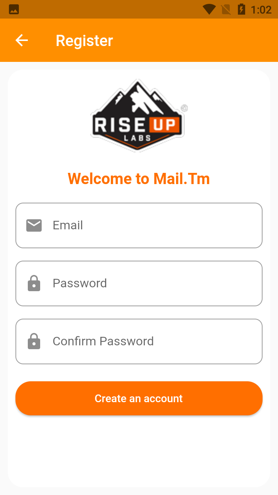
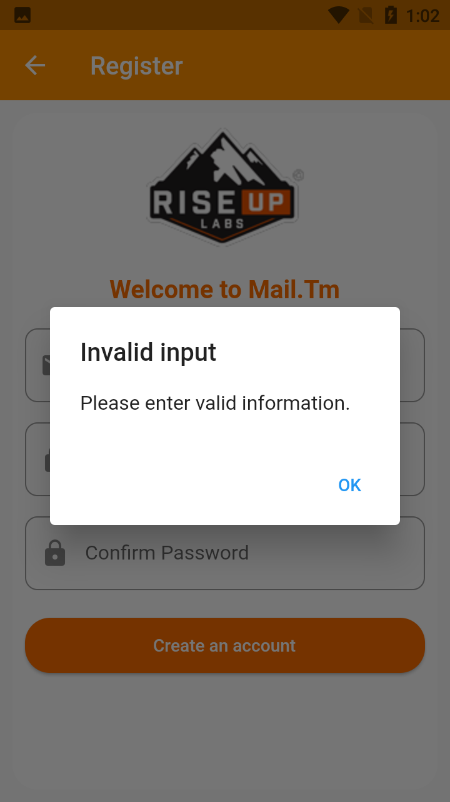
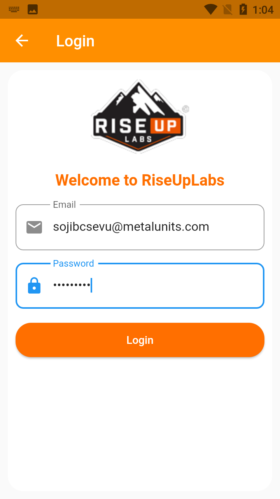
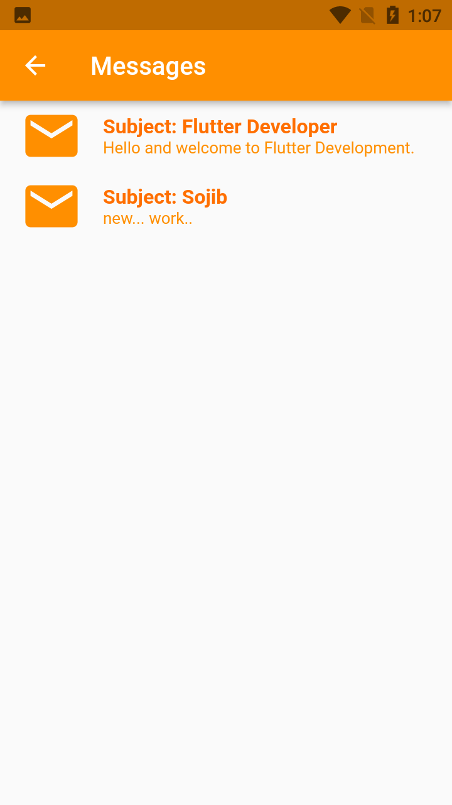

# Temp Mail

This Flutter Project is a Test Assignment given by RiseUpLabs for the position of "Flutter Developer". 
This project is using the API service of Temp Mail (api.mail.tm). 
Only 4 major tasks are done in this project. 
These are:
1. Fetching the available Domain names.
2. Creating an account using the available domain name.
3. Login into that created account.
4. Fetching the messages or mails of the logged in account.

For the state management, I used Getx Package.
 

 

Here are some screenshots of the project:
 
Splash Screen:
 

 
Domain List Screen:
 

 
Registration Screen:
 

 
Registration Screen (for Invalid input):
 

 
Login Screen:
 

 
Message (Mail) List Screen:
 

 
Working APK link: https://drive.google.com/file/d/1-ZjThQEpO2XAjFCaPPv4FUZu9uC6LS7e/view?usp=sharing

[N: B: Due to the mid-term exam on 01-11-21, I had to compromize the UI.]

